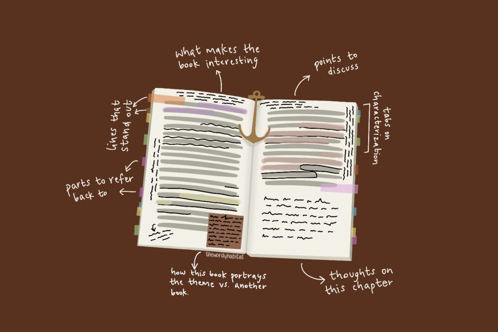

> [!Warning]
> This project is still in progress, so some informations might be missing below and will be filled in time.

# Reader
Reader is a web app that facilitates active reading. The goal is to create a space that will help you interact with your book's content via annotations, connect ideas across-books and easily review them.

# Try it
> Soon

# How it works
> Diagrams coming up
